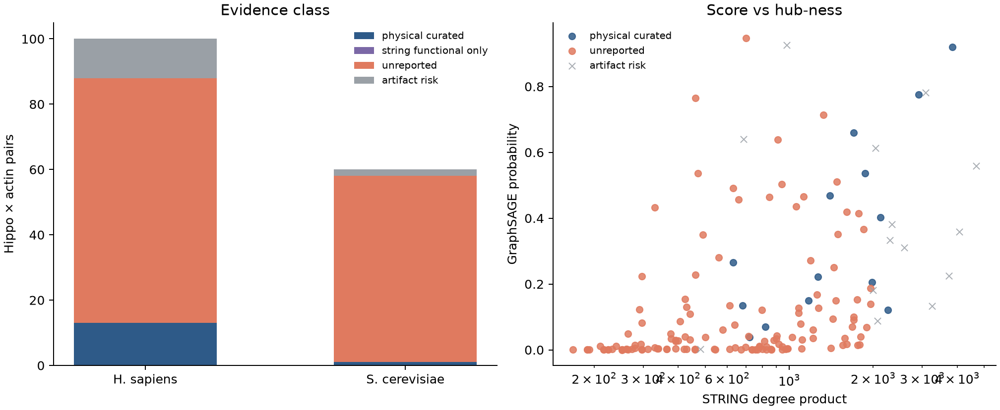

# HippoActInteract

Evidence atlas of **Hippo/RAM × actin candidate associations** inside a 359-protein STRING v12 neighborhood. Each pair is joined to BioGRID and IntAct on UniProt accession, labeled with STRING channel scores, and overlaid with a GraphSAGE rank. STRING functional edges are context, not a physical-binding claim.



Left: exclusive catalog class by species. Right: GraphSAGE score versus STRING degree product.

## Biological context

The Hippo pathway (MST1/2–LATS1/2–YAP/TAZ/TEAD in humans) controls organ size and contact inhibition. YAP/TAZ activity is tightly coupled to **F-actin and cytoskeletal tension**, but catalogs disagree about which pairs have physical support.

This project stays small enough for a 16 GB Apple M2:

- **Human (NCBI 9606):** Hippo seeds YAP1, WWTR1 (TAZ), LATS1/2, STK3/4, SAV1, MOB1A, NF2, TEAD1 and actin seeds ACTB, CFL1, PFN1, GSN, DIAPH1, ACTN1, VCL, RHOA, CDC42, RAC1.
- **Yeast (4932):** there is no YAP/TAZ. The RAM/MOR network (CBK1, KIC1, MOB2, TAO3, SOG2, HYM1) is the Hippo-like module, paired with ACT1 and polarity/actin regulators.

STRING partners are expanded at combined score ≥ 700 (max 20 per seed). The result is **359 proteins** and **2,484** undirected edges — not a whole-proteome dump. The atlas itself is the **160** same-species Hippo × actin pairs among the 36 seeds.

## Method

### Evidence atlas

BioGRID organism TAB3 (physical vs genetic) and IntAct PSI-MI TAB are joined on UniProt accession. STRING channel scores are fetched for atlas proteins. Each pair is `physical_curated`, `string_functional_only`, `unreported`, or `artifact_risk`.

### Node features (ESM-2)

Each sequence is encoded with Meta’s `facebook/esm2_t12_35M_UR50D` (hidden size 480). Residue hidden states are **mean-pooled**, excluding CLS/EOS/pad. Sequences longer than 1022 amino acids are truncated to the ESM-2 context limit.

### GraphSAGE ranking

Observed STRING edges are split **per species** 80 / 10 / 10. Message passing uses **train edges only**. Negatives are random same-species non-edges. That AUROC is a methods check on functional STRING edges. Physical BioGRID/IntAct labels are a separate benchmark (`make benchmark`).

## Results (this run)

Atlas (160 Hippo × actin pairs; 156 absent from STRING ≥ 700):

| STRING-absent class | n | fraction |
|---|---:|---:|
| unreported | 132 | 84.6% |
| physical_curated (BioGRID/IntAct) | 13 | 8.3% |
| artifact_risk | 11 | 7.1% |

GraphSAGE probability vs STRING degree product, Spearman **0.58**. Yeast Act1–Kic1 is unreported; human YAP1–ACTB is already Affinity Capture–MS but STRING combined score 0.515. These are **candidate associations**, not bindings.

STRING-edge test AUROC 0.910 vs Adamic–Adar 0.904 (random negatives, one seed) is neighborhood recovery, not physical discovery. On BioGRID/IntAct physical labels (3,124 edges, 20 seeds), logistic regression on degree and common neighbors reaches AUROC **0.741 ± 0.019**; GraphSAGE+ESM-2 is **0.720 ± 0.026** and does not beat Adamic–Adar (**0.732 ± 0.018**). Sequence features help on degree-matched negatives.

## Run with Docker

The runtime is the `hippoact:latest` image (linux/arm64, CPU PyTorch). There is no local virtualenv. Docker Desktop on Mac cannot use Metal (`mps`); in-container training is CPU and is fast on this 359-node graph.

```bash
docker compose build
make test          # unit tests (no live BioGRID/IntAct download)
make fetch         # STRING + UniProt download
make embed         # ESM-2 node features
make arch          # GNN shape check
make train         # train + hit list
make viz           # NetworkX figure
make atlas         # BioGRID/IntAct atlas; runs benchmark if the Phase 1 gate opens
make benchmark     # physical-label benchmark only (needs atlas outputs)
```

Set `HIPPO_SKIP_BENCHMARK=1` on the atlas container to stop after the CSV/QC JSON.

```bash
docker compose run --rm -e HIPPO_SKIP_BENCHMARK=1 --entrypoint python pipeline -m src.evidence_atlas
```

Reclaim disk (image + Hugging Face cache volume):

```bash
make clean
```

### Outputs

| Path | Contents |
|---|---|
| `data/raw/proteins.csv`, `interactions.csv`, `proteins.fasta` | STRING/UniProt graph |
| `data/raw/evidence/` | BioGRID TAB3, IntAct MITAB, STRING channels, UniProt locations |
| `data/processed/hippo_actin_atlas.csv` | 160-row evidence atlas |
| `data/processed/atlas_qc.json`, `atlas_stats.json` | QC and missingness stats |
| `data/processed/physical_edges.csv` | BioGRID/IntAct physical edges in the 359-protein set |
| `data/processed/node_embeddings.pt` | `[359, 480]` float32 features |
| `data/processed/gnn_best.pt` | Best GraphSAGE weights (STRING-edge training) |
| `data/processed/top_predicted_interactions.csv` | Ranked STRING-absent Hippo–actin pairs (top 50) |
| `data/processed/benchmark_metrics.json` | 20-seed physical-label AUROC/AP/CIs |
| `data/processed/benchmark_stability.csv` | Median ranks of STRING-absent Hippo×actin pairs |
| `figures/figure4_evidence_classes.png` | Evidence-class stacked bars |
| `figures/figure5_physical_benchmark.png` | Physical-label AUROC bars |

## Hardware notes

- Target: Apple M2, 16 GB unified memory.
- ESM-2 35M peak RSS during embedding was ~650 MB.
- PyPI linux/aarch64 `torch` wheels can pull CUDA libraries; the Dockerfile installs **CPU** torch from `https://download.pytorch.org/whl/cpu`.

## Limitations

- A high GraphSAGE probability is not experimental evidence and is not a binary contact.
- BioGRID “physical” is not the same as a reconstituted pair.
- STRING ≥ 700 is incomplete; some “novel” pairs exist in BioGRID/IntAct or at lower STRING scores.
- 89 long proteins were truncated at 1022 residues.
- Human and yeast graphs are trained together but never share edges.
- Docker uses CPU, not MPS.

## License / data

STRING (https://string-db.org), UniProt, BioGRID, and IntAct are used via their public files/APIs for research. ESM-2 weights are loaded from Hugging Face (`facebook/esm2_t12_35M_UR50D`).
