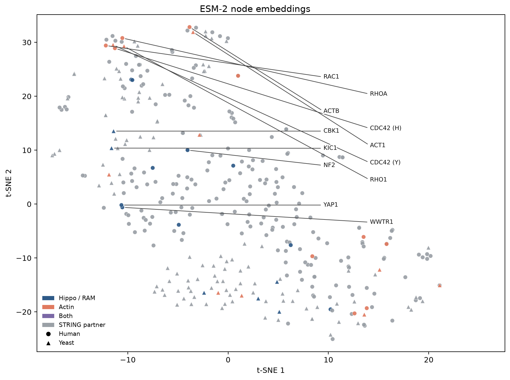
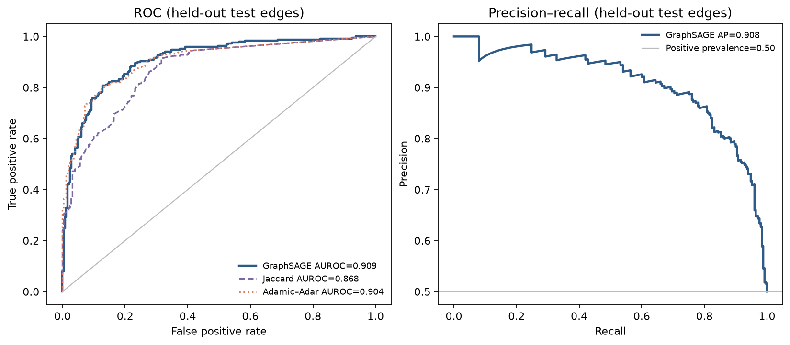
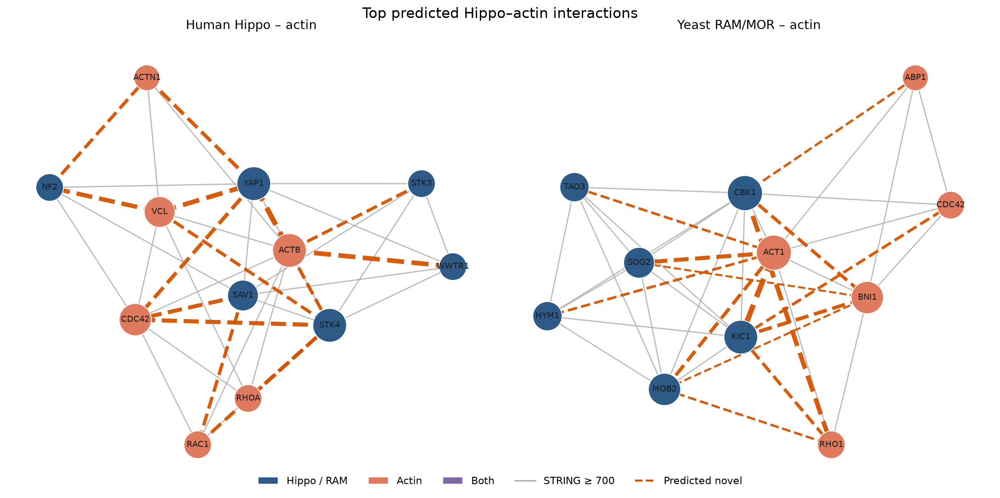
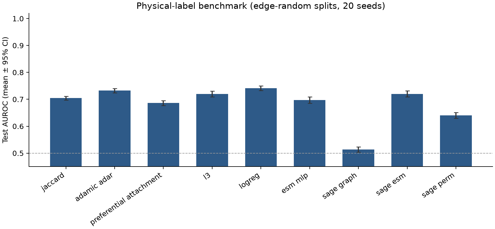

# An evidence-aware atlas of Hippo/RAM–actin candidate associations

**Author:** TBD

**Keywords:** Hippo pathway; actin cytoskeleton; protein–protein interactions; BioGRID; IntAct; STRING; ESM-2; GraphSAGE; link prediction

---

## Abstract

The Hippo pathway and the actin cytoskeleton sit in the same mechanical circuit. STRING, BioGRID, and IntAct often disagree on which protein pairs are supported—and by what assay. We mapped every same-species Hippo × actin pair inside a 359-protein STRING v12 neighborhood built around human Hippo and yeast RAM/MOR seeds, then compared that join with a GraphSAGE ranker.

The atlas has 160 pairs (100 human, 60 yeast). Four already appear in STRING at combined score ≥ 700. The remaining 156 are not one story. Thirteen (8.3%) already have BioGRID physical or IntAct records. Another 11 (7.1%) we flag as artifact-risk, usually hub degree or text-mining-only STRING support. 132 pairs (84.6%) are unreported in all three resources at our cutoffs. Support that does exist is uneven. Yeast records are mostly genetic. Human ones are mostly affinity purification–mass spectrometry (AP–MS) or proximity labeling. GraphSAGE scores on the 156 STRING-absent pairs correlate with STRING degree product (Spearman 0.58) and shared-neighbor count (0.46), which is worth keeping in mind when reading the ranks. Highest STRING-absent score is yeast Act1–Kic1 (0.947), unreported. Human YAP1–ACTB is second (0.920). That pair is already Affinity Capture–MS; STRING combined score 0.515.

---

## 1. Introduction

Cells sense their surroundings largely through actin. Cortical F-actin and actomyosin help set furrow geometry and position the spindle; they also transmit mechanical load into adhesions. The same filaments report stiffness, crowding, and polarity into intracellular signaling pathways.

Hippo is one of the pathways that get that information. In animals, MST1/2 phosphorylate LATS1/2, which keep YAP and TAZ (WWTR1) cytoplasmic. When YAP/TAZ enter the nucleus they drive TEAD-dependent programs that couple cytoskeletal state to growth [1,2]. Budding yeast has no YAP/TAZ ortholog. The RAM/MOR module, organized around the kinases Cbk1 and Kic1, does analogous work at the actin-rich bud cortex [3]. The analogy is real enough as a circuit diagram. It does not tell you which proteins physically meet.

STRING, BioGRID, and IntAct are the usual places to look, and they do not encode the same thing. STRING’s combined score folds experiments together with co-expression, co-annotation, and text mining [4,5]. BioGRID and IntAct curate physical and genetic records, with assay names and publications attached [19,20]. Practically, a pair can be a high-confidence STRING edge without a curated physical assay. The reverse happens too: it can sit in BioGRID and still fall below STRING’s commonly used combined-score cutoff of 700.

We assembled an evidence atlas for every Hippo/RAM × actin pair inside an existing 359-protein STRING neighborhood. Each pair is tagged by what is actually there—curated physical support, STRING-functional support only, nothing in any of the three resources, or an artifact-risk look. A GraphSAGE rank trained on STRING edges is overlaid on that tagging. The unreported set turned out to be large. Large enough that we also asked whether topology or sequence recover BioGRID/IntAct physical labels if STRING is only the context graph, not the evaluation label.

None of this reconstitutes binary contacts. If a pair is worth chasing, yeast two-hybrid and AP–MS are still the right experiments. They are just not a practical way to screen every Hippo × actin combination. They are also not STRING functional edges.

---

## 2. Materials and Methods

### 2.1 Network construction

We pulled interactomes from the STRING v12 REST API for _Homo sapiens_ (NCBI Taxonomy 9606) and _Saccharomyces cerevisiae_ (4932) [4,5,18].

Human Hippo seeds were YAP1, WWTR1 (TAZ), LATS1, LATS2, STK3, STK4, SAV1, MOB1A, NF2, and TEAD1. The actin list was ACTB, CFL1, PFN1, GSN, DIAPH1, ACTN1, VCL, RHOA, CDC42, and RAC1. Yeast has no YAP/TAZ, so we paired the RAM/MOR set CBK1, KIC1, MOB2, TAO3, SOG2, and HYM1 with ACT1, COF1, PFY1, BNI1, BNR1, CDC42, RHO1, SAC6, TPM1, and ABP1.

STRING identifiers were resolved with `get_string_ids`. Partners came from `interaction_partners` at combined score ≥ 700. Expansion was capped at 20 partners per seed. We downloaded the induced functional network with the `network` method. Amino-acid sequences came from UniProt [6]. Two human proteins, SLC9A3R1 and WAS, had no recoverable canonical sequence and were dropped. Self-loops were removed; duplicate edges collapsed to a single undirected pair.

Human and yeast proteins do not form cross-species edges in this setting. The undirected network is just the two species subgraphs placed side by side. Preferred names, taxonomy IDs, UniProt accessions, and Hippo versus actin labels were stored with the edge list.

### 2.2 Evidence atlas

The atlas is every same-species Hippo × actin pair among the 36 seed proteins (10 human Hippo × 10 human actin = 100 pairs; 6 yeast RAM × 10 yeast actin = 60 pairs; 160 in total). STRING partners stay in the graph as neighborhood context. They are not extra atlas rows.

After downloading BioGRID organism TAB3 files (release 5.0.260) for human and _S. cerevisiae_ S288c [19], we kept physical versus genetic experimental-system type, assay name, throughput, and PubMed identifiers. IntAct was queried through PSIQUIC as PSI-MI TAB 2.5 for every UniProt accession in `proteins.csv` [20]. From those rows we stored detection method, interaction type, and PubMed identifiers. Joins were on UniProt accession. Records were kept only if both ends fall inside the 359-protein set.

STRING channel scores (neighborhood, fusion, co-occurrence, co-expression, experiments, databases, and text mining) were fetched with the `network` method at required score 150 among the 36 Hippo/actin proteins, so that support below 700 remains visible. UniProt subcellular location and GO cellular component terms were mapped onto coarse buckets: nucleus, cytoplasm, cortex, cytoskeleton, extracellular, mitochondrion. If the buckets intersect, localization was scored compatible. Conflicting was reserved for one protein exclusively extracellular and the other exclusively nuclear or mitochondrial. Anything else was unclear, including nuclear versus cortical, because YAP shuttles.

Each pair received one exclusive class:

- `physical_curated` — BioGRID physical or IntAct, even if the STRING combined score is &lt; 700.
- `string_functional_only` — STRING combined score ≥ 700 and no curated physical record.
- `unreported` — absent from BioGRID physical, IntAct, and STRING ≥ 700.
- `artifact_risk` — not curated physical, and either a localization conflict, text-mining-only STRING support at ≥ 700, or a STRING degree product at or above the atlas 90th percentile (1957.5).

Genetic-only yeast pairs (BioGRID genetic, with neither a physical BioGRID record nor an IntAct record) were flagged separately and were not promoted to `physical_curated`.

### 2.3 Sequence features

Node features came from amino-acid sequence alone. We used a frozen ESM-2 encoder—the 12-layer, 35-million-parameter checkpoint `facebook/esm2_t12_35M_UR50D` [7,8]—loaded from Hugging Face [9] and not fine-tuned on interaction labels.

Sequences that exceeded the ESM-2 context window of 1,024 tokens (including special tokens) were truncated to 1,022 residues. That hit 89 proteins. Residue hidden states (480 dimensions) were mean-pooled after special and padding tokens were ignored. One vector per protein; those were stacked into a 359 × 480 feature matrix. Embeddings were computed with PyTorch [10] on CPU inside a linux/arm64 Docker image on Apple Silicon. The same code path can use Metal (`mps`) if run natively on macOS.

### 2.4 GraphSAGE ranking on STRING edges

A two-layer GraphSAGE encoder with mean aggregation updates each protein from its neighbors [11,12]:

The first layer maps 480-dimensional ESM-2 features to 64 dimensions. The second stays at 64. Dropout of 0.2 during training. Message passing uses training edges only, stored as a bidirectional `edge_index`, so validation and test positives never enter a node’s neighborhood.

A pair (u, v) is scored by a two-layer multilayer perceptron (MLP) followed by a sigmoid:

The graph is undirected, so we average both orderings of each pair. Encoder and decoder together have 82,177 trainable parameters.

Known STRING edges were split 80/10/10 within each species (1,986 / 248 / 250 positives), with random same-species non-edges at a 1:1 negative ratio. Cross-species pairs were excluded. Loss was binary cross-entropy (BCE). We trained with Adam (learning rate 0.001, weight decay 0.0001) [13] for at most 80 epochs. Early stopping was on validation AUROC (patience 10). Training stopped at epoch 40. The best checkpoint was from epoch 30.

Those weights were then used to score every Hippo × actin pair so that atlas ranks cover all 156 STRING-absent pairs, not only the previously exported top 50.

### 2.5 Physical-label benchmark

Most STRING-absent Hippo × actin pairs were unreported, and GraphSAGE ranks tracked degree, so we ran a second evaluation. Labels were BioGRID physical or IntAct records among the 359 UniProt IDs (3,124 edges; 1,187 of them have a tier-1 or binary-ish assay). STRING functional edges stayed as the context graph, not the evaluation label. Validation and test physical pairs were removed from message passing when they also appear in STRING.

Splits were frozen per seed under `data/processed/benchmark_splits/`. Three protocols: a random edge split; a node-disjoint split (train, validation, and test proteins do not overlap); and degree-matched negatives on a random edge split. On identical splits we scored Jaccard, Adamic–Adar, preferential attachment, and L3. We also scored a logistic regression on degree and common neighbors. Learned models were an ESM-only MLP, graph-only GraphSAGE with constant features, and GraphSAGE with ESM-2 features. We also ran GraphSAGE with permuted ESM-2 rows. Each protocol, 20 random seeds. Training was full-batch Adam for at most 20 epochs, early stopping on validation AUROC (patience 5). We report mean ± standard deviation and a normal-approximation 95% confidence interval, plus precision@10/20/50 and paired seed-wise AUROC differences versus Adamic–Adar. Candidate stability is just the median rank of the 156 STRING-absent Hippo × actin pairs across the 20 edge-random GraphSAGE+ESM runs.

---

## 3. Results

### 3.1 The graph and the embedding space

The network has 359 proteins and 2,484 undirected STRING edges (234 human nodes, 125 yeast). Density is 0.0387 overall, 0.0617 in human, 0.104 in yeast. Each species subgraph is internally connected, so the full graph is two components with no isolated nodes. Tight around the seeds; not a proteome extract. Mean degree is 13.8 (median 11; maximum 85). Skewed toward actin and Rho-family GTPases, as one would expect.

Figure 1 is a t-SNE of the ESM-2 vectors (perplexity 30, PCA initialization, seed 42) [14,15]. Human and yeast proteins intermix, so the language model is not just separating species. YAP1 lies near WWTR1. Human ACTB is close to yeast ACT1 (Euclidean distance 0.29 in the original 480-dimensional space). CDC42, RHOA, and RAC1 form a GTPase patch (human versus yeast CDC42 distance 0.52). CBK1, KIC1, and NF2 sit somewhere else. STRING partners fill out the rest of the map. They do not collapse into one blob.

**Figure 1.** t-SNE of 359 ESM-2 embeddings (480 dimensions). Circles, human; triangles, yeast. Blue, Hippo/RAM; coral, actin; purple, both; gray, STRING partners.

### 3.2 STRING-edge recovery is mostly neighborhood overlap

On held-out STRING edges, GraphSAGE reached AUROC 0.910 and average precision 0.910 (Table 1, Figure 2). Validation AUROC at epoch 30 was 0.931. Chance on this balanced test set is 0.5.

The comparison that actually matters is neighborhood overlap on the training graph only. Jaccard reached AUROC 0.868 and AP 0.868. Adamic–Adar was 0.904 and 0.910 [16]. GraphSAGE’s increment over Adamic–Adar is 0.006 in AUROC. It ties on average precision. On a graph this small and this dense, shared neighbors already recover most held-out STRING edges. Sequence features and learned aggregation add something. Not much.

**Figure 2.** Held-out test ROC (left) and precision–recall (right) for GraphSAGE, Jaccard, and Adamic–Adar on STRING ≥ 700 edges.

**Table 1.** Link prediction on held-out STRING edges (500 labeled pairs). Heuristics use the training graph only.

| Method              | AUROC |    AP |
| ------------------- | ----: | ----: |
| Jaccard coefficient | 0.868 | 0.868 |
| Adamic–Adar index   | 0.904 | 0.910 |
| GraphSAGE + MLP     | 0.910 | 0.910 |

### 3.3 Complementary evidence among STRING, BioGRID, IntAct, and GraphSAGE

We scored 160 Hippo × actin pairs. Four of them are already STRING edges at combined score ≥ 700. NF2–CDC42 is the one with a BioGRID physical record, supported by the databases channel. The other three—SAV1–DIAPH1, yeast Act1–Cbk1, Cdc42–Cbk1—are text-mining-heavy hub pairs, so we classed them as artifact-risk rather than STRING-functional-only. There is no Hippo × actin pair in this neighborhood that is a STRING ≥ 700 edge without a curated physical record.

Of the remaining 156 STRING-absent pairs, 13 (8.3%) already have BioGRID physical or IntAct support. 11 (7.1%) are artifact-risk—all human, all high degree-product. STRING support, where it exists, is text mining (WWTR1–ACTB, YAP1–CDC42, related GTPase hubs). 132 pairs are unreported at our cutoffs (84.6%). Figure 4.

Human and yeast do not look the same. Of 98 STRING-absent human pairs, 12 are curated physical (12.2%). 75 are unreported. Yeast is thinner: one curated physical pair out of 58 (Act1–Tao3, an IntAct “inferred by author” record sitting next to a BioGRID positive-genetic annotation) and 57 unreported. Ten yeast pairs are genetic-only. None of the human ones are.

Across the 359 proteins, BioGRID and IntAct together contribute 3,124 same-species physical edges, 1,187 of them with a tier-1 or binary-ish assay. Of those physical edges, 1,261 also appear in STRING ≥ 700. The other 1,863 do not. Going the other way, STRING ≥ 700 contains 1,223 edges with no physical record in this join. The catalogs overlap. They are not interchangeable.

GraphSAGE probability among the 156 STRING-absent pairs correlates with STRING degree product (Spearman 0.58) and shared-neighbor count (0.46). High rank is, in part, being a hub in a dense STRING subgraph.

Table 2 is the top ten STRING-absent pairs. Rank 1 is Act1–Kic1 (0.947). It is unreported: no BioGRID physical record, no IntAct record, STRING combined score 0.176 (text mining). Kic1 functions at the actin-rich bud cortex, so an association with Act1 would put RAM/MOR on the cortical cytoskeleton fairly economically. That is why we linger on it. Rank 2 is not a new proposal at all. YAP1–ACTB (0.920) is already Affinity Capture–MS in BioGRID (two papers), STRING combined score 0.515. The STRING-only pipeline treated it as novel only because 0.515 lies below 700. A co-complex with β-actin would fit YAP’s known sensitivity to cortical tension. Rank 3, WWTR1–ACTB, is artifact-risk (degree product 3,080; text mining). Lower down, the list thins out. VCL–YAP1 and STK4–CDC42 have proximity labeling or AP–MS; VCL–NF2 is unreported; Act1–Sog2 is yeast genetic-only.

**Figure 3.** Top GraphSAGE-ranked Hippo–actin links in human (left) and yeast (right). Solid gray, STRING ≥ 700; dashed orange, STRING-absent pairs [17]. Evidence class is reported in Table 2.

**Figure 4.** Left: exclusive evidence class by species (160 pairs). Right: GraphSAGE probability versus STRING degree product. Physical curated pairs (blue) can still be hubs; artifact-risk pairs (gray) occupy the high-degree, non-physical tail.

**Table 2.** Top ten GraphSAGE-ranked Hippo × actin pairs absent from STRING at combined score ≥ 700, with catalog class.

| Rank | Species         | Pair       | Class            | Probability |             STRING | Catalog                                |
| ---: | --------------- | ---------- | ---------------- | ----------: | -----------------: | -------------------------------------- |
|    1 | _S. cerevisiae_ | ACT1–KIC1  | unreported       |       0.947 | 0.176, text mining | none                                   |
|    2 | _H. sapiens_    | YAP1–ACTB  | physical_curated |       0.920 | 0.515, text mining | BioGRID Affinity Capture–MS (2 papers) |
|    3 | _H. sapiens_    | WWTR1–ACTB | artifact_risk    |       0.782 | 0.306, text mining | none; hub (degree product 3080)        |
|    4 | _H. sapiens_    | VCL–YAP1   | physical_curated |       0.776 | 0.357, text mining | BioGRID Proximity Label–MS             |
|    5 | _S. cerevisiae_ | CBK1–RHO1  | unreported       |       0.765 | 0.282, text mining | none                                   |
|    6 | _H. sapiens_    | VCL–NF2    | unreported       |       0.714 | 0.596, text mining | none                                   |
|    7 | _H. sapiens_    | STK4–CDC42 | physical_curated |       0.659 | 0.213, text mining | BioGRID proximity + AP–MS              |
|    8 | _S. cerevisiae_ | ACT1–SOG2  | unreported       |       0.638 | 0.368, text mining | BioGRID positive genetic only          |
|    9 | _H. sapiens_    | SAV1–CDC42 | artifact_risk    |       0.613 | 0.244, text mining | none; hub                              |
|   10 | _H. sapiens_    | YAP1–CDC42 | artifact_risk    |       0.559 | 0.346, text mining | none; hub (degree product 4675)        |

### 3.4 Physical-label benchmark

Most of the STRING-absent Hippo × actin pairs are unreported. GraphSAGE rank tracks degree (Spearman 0.58). We therefore retrained against BioGRID/IntAct physical edges among the 359 proteins (n = 3,124), keeping STRING as a leak-safe context graph.

On edge-random splits, logistic regression on degree and common neighbors has the highest mean AUROC, 0.741 ± 0.019 (Table 3, Figure 5). Adamic–Adar is 0.732 ± 0.018. GraphSAGE+ESM-2 reached 0.720 ± 0.026, matching L3, and sits 0.012 below Adamic–Adar on a paired seed-wise difference (95% CI −0.025 to 0.001). Graph-only GraphSAGE is essentially chance (0.514). Permuting ESM-2 rows drops GraphSAGE to 0.640. So the model is using sequence. Just not enough to beat a two-feature logistic model when negatives are random.

Degree-matched negatives change who wins. Preferential attachment goes to 0.506, which is the point of matching on degree product. Adamic–Adar falls to 0.632. GraphSAGE+ESM-2 then beats the topological baselines (0.684 ± 0.020). So does the ESM-only MLP (0.672 ± 0.021). Sequence is more informative once hub-ness is harder to use.

Node-disjoint splits are a stretch on 234 and 125 nodes. Jaccard and Adamic–Adar fall to 0.408; GraphSAGE+ESM-2 is 0.472 ± 0.100. Only the ESM-only MLP is clearly above chance (0.613 ± 0.082). Shared-neighbor features do not carry over well to proteins the model has not seen.

When the physical-label GraphSAGE ranks the same 156 STRING-absent pairs, the ranks that stay high across seeds are MST kinases with Rho-family GTPases. RHOA–STK3 has median rank 3.0 and is in the top 10 in 20/20 seeds. Then STK4–RHOA (3.5), STK3–CDC42 (4.0), STK4–CDC42 (4.5). STK4–CDC42 already has BioGRID proximity labeling and AP–MS, so that one is less of a surprise. Act1–Kic1 led the STRING-trained list. Median rank here is 29.5; it never enters the top 10. YAP1–ACTB sits at 22.5. The two label sets do not prioritize the same pairs.

**Figure 5.** Mean test AUROC ± 95% CI on BioGRID/IntAct physical labels, edge-random splits, 20 seeds. STRING is used as the context graph.

**Table 3.** Physical-label link prediction (3,124 BioGRID/IntAct edges among 359 proteins; 20 seeds; mean ± sd). STRING ≥ 700 is not the evaluation label.

| Method                     | Edge-random AUROC | Degree-matched AUROC | Node-disjoint AUROC |
| -------------------------- | ----------------: | -------------------: | ------------------: |
| Jaccard                    |     0.704 ± 0.015 |        0.629 ± 0.015 |       0.408 ± 0.023 |
| Adamic–Adar                |     0.732 ± 0.018 |        0.632 ± 0.012 |       0.408 ± 0.023 |
| Preferential attachment    |     0.686 ± 0.022 |        0.506 ± 0.002 |       0.284 ± 0.034 |
| L3                         |     0.720 ± 0.024 |        0.577 ± 0.010 |       0.319 ± 0.040 |
| Logistic regression        |     0.741 ± 0.019 |        0.645 ± 0.016 |       0.060 ± 0.024 |
| ESM-only MLP               |     0.697 ± 0.026 |        0.672 ± 0.021 |       0.613 ± 0.082 |
| GraphSAGE (graph only)     |     0.514 ± 0.021 |        0.508 ± 0.018 |       0.472 ± 0.125 |
| GraphSAGE + ESM-2          |     0.720 ± 0.026 |        0.684 ± 0.020 |       0.472 ± 0.100 |
| GraphSAGE + permuted ESM-2 |     0.640 ± 0.024 |        0.598 ± 0.038 |       0.467 ± 0.122 |

---

## 4. Discussion

YAP1–ACTB is a useful example of what the atlas is actually doing. GraphSAGE ranks it highly, and BioGRID already has Affinity Capture–MS; STRING’s combined score just never crossed 700. Calling it a newly proposed contact is misleading. It is a record that did not transfer.

If YAP is recovered in β-actin-containing complexes, the coactivator can sample cortical actin. Given how YAP localization tracks cytoskeletal tension, that picture is not surprising. Still an inference from co-complex, not a mapped interface.

Act1–Kic1 is the pair we would most like to be real. Highest STRING-absent score, nothing curated in this join, localization compatible, degree product not outrageous. Kic1 acts at the bud cortex, where actin concentrates during polarized growth, so an Act1 association would give RAM/MOR a direct cytoskeletal readout. The physical-label model is unimpressed: median rank 29.5, never in the top 10. That should perhaps settle the ranking question. We still keep circling back to it more than those ranks really justify. It is a reasonable wet-lab target. It is not, on present evidence, a mechanism. We keep having to remind ourselves of that.

Human evidence in this neighborhood is almost entirely co-complex or proximity capture. Yeast RAM × actin, when it shows up at all, is genetic. So what is a STRING ≥ 700 positive actually labeling? Functional association and literature co-occurrence, mostly. Adamic–Adar already reaches AUROC 0.904 on STRING edges and 0.732 on physical labels. GraphSAGE does not beat that in a matched comparison, which is the part that took us a while to sit with. Sequence features do help when neighborhood overlap is taken off the table—degree-matched negatives, node-disjoint proteins. That is probably the more honest use of ESM-2 here. It is not the result we would have led with.

Artifact-risk annotations fall mostly on human GTPase and actin hubs. The 90th-percentile degree-product cutoff is conservative on purpose, which means it will sometimes flag genuine biology that happens to involve a hub. Fine. We would rather over-flag than let a high decoder probability stand alone when both proteins are STRING hubs and the only supporting channel is text mining.

A few constraints that actually bite. This is a catalog join, not reconstituted binary contacts. A BioGRID physical record is not a two-hybrid result. We also counted IntAct entries annotated “inferred by author” as IntAct support; that last choice is generous, and someone could reasonably disagree. Negatives in both evaluations are random non-edges rather than experimentally confirmed non-interactions, so AUROC is likely inflated. We have not tried to correct for that. Eighty-nine sequences were truncated at 1,022 residues, so C-terminal information is missing for those proteins. The embeddings otherwise look complete. The atlas is the 36 Hippo/RAM and actin seeds, not every STRING partner in the 359-protein graph. Expanding it would be a different paper. Node-disjoint test sets on 125–234 nodes are small. The logistic regression AUROC of 0.060 in that protocol is a degree-based classifier falling over, not a biological result. The reported run used CPU inside Docker rather than Metal. Reproducible; we did not want the methods section to depend on a laptop GPU. The pairs we still care about still need orthogonal wet-lab work: co-immunoprecipitation or proximity labeling, and a mutant if there is even a guess at an interface.

---

## 5. Conclusion

Inside a 359-protein STRING neighborhood of Hippo/RAM and actin proteins there are 160 same-species Hippo × actin pairs. 156 of them are absent from STRING at combined score ≥ 700. Thirteen of those already have curated physical records. 132 do not. GraphSAGE ranks the unreported set, with the caveat that those ranks track hub-ness. Switch the labels to BioGRID/IntAct physical edges and a logistic model of degree and common neighbors matches or exceeds GraphSAGE. The useful object, as we see it, is the evidence atlas. The learned ranks are a column in that table, not the point of the paper.

---

## 6. Code and data

The HippoActInteract repository that accompanies this manuscript has the scripts for STRING and UniProt download, BioGRID and IntAct ingest, ESM-2 embedding, training, atlas construction, the physical-label benchmark, and figure generation. There was no public GitHub remote at the time of writing. The analysis can be repeated with `docker compose build` followed by `make fetch embed train viz atlas`. The `make atlas` target writes `data/processed/hippo_actin_atlas.csv` and, when a substantial unreported set remains, runs `make benchmark`. Dependency versions are pinned in `requirements.txt` (PyTorch 2.13 CPU, PyTorch Geometric 2.8, `transformers` 5.15). Data portals and software citations are listed in Section 7.

---

## 7. References

### Biological background

1. **The Hippo signaling pathway in development and cancer.** Pan D. _Developmental Cell_ 19, 491–505 (2010). https://doi.org/10.1016/j.devcel.2010.09.011

2. **Role of YAP/TAZ in mechanotransduction.** Dupont S, Morsut L, Aragona M, Enzo E, Giulitti S, Cordenonsi M, Zanconato F, Le Digabel J, Forcato M, Bicciato S, Elvassore N, Piccolo S. _Nature_ 474, 179–183 (2011). https://doi.org/10.1038/nature10137

3. **RAM: a conserved signaling network that regulates Ace2p transcriptional activity and polarized morphogenesis.** Nelson B, Kurischko C, Horecka J, Mody M, Nair P, Pratt L, Zougman A, McBroom LD, Hughes TR, Boone C, Luca FC. _Molecular Biology of the Cell_ 14, 3782–3803 (2003). https://doi.org/10.1091/mbc.e03-05-0301

### Data sources

4. **The STRING database in 2023: protein–protein association networks and functional enrichment analyses for any sequenced genome of interest.** Szklarczyk D, Kirsch R, Koutrouli M, Nastou K, Mehryary F, Hachilif R, Gable AL, Fang T, Doncheva NT, Pyysalo S, Bork P, Jensen LJ, von Mering C. _Nucleic Acids Research_ 51, D638–D646 (2023). https://doi.org/10.1093/nar/gkac1000

5. **STRING v12.0 protein association networks (this study).** Functional interactomes for _Homo sapiens_ (taxon 9606) and _Saccharomyces cerevisiae_ (taxon 4932) were downloaded through the version 12.0 REST API (`get_string_ids`, `interaction_partners`, `network`; combined score ≥ 700; channel scores at required score 150 for atlas proteins). Database: https://string-db.org — API used: https://version-12-0.string-db.org/api — access notes: https://version-12-0.string-db.org/cgi/access

6. **UniProt: the Universal Protein Knowledgebase in 2023.** The UniProt Consortium. _Nucleic Acids Research_ 51, D523–D531 (2023). https://doi.org/10.1093/nar/gkac1052 — sequences and locations retrieved from https://rest.uniprot.org/uniprotkb/search — portal: https://www.uniprot.org

7. **The BioGRID database: A comprehensive biomedical resource of curated protein, genetic, and chemical interactions.** Oughtred R, Rust J, Chang C, Breitkreutz BJ, Stark C, Willems A, Boucher L, Leung G, Kolas N, Zhang F, Dolma S, Nixon J, Sullivan A, Pescott JL, Tyers M, Dolinski K. _Protein Science_ 30, 187–200 (2021). https://doi.org/10.1002/pro.3978 — organism TAB3 files from https://downloads.thebiogrid.org (release 5.0.260 in this run)

8. **The IntAct database: efficient access to fine-grained molecular interaction data.** Del Toro N, Shrivastava A, Ragueneau E, Meldal B, Combe C, Barrera E, Perfetto L, How K, Ratan P, Shirodkar G, Lu O, Mészáros B, Watkins X, Licata L, Panneerselvam K, Cesareni G, Orchard S, Hermjakob H. _Nucleic Acids Research_ 50, D648–D653 (2022). https://doi.org/10.1093/nar/gkab1038 — PSIQUIC MITAB 2.5: https://www.ebi.ac.uk/Tools/webservices/psicquic/intact/webservices/current/search/query

### Models and algorithms

7. **Evolutionary-scale prediction of atomic-level protein structure with a language model.** Lin Z, Akin H, Rao R, Hie B, Zhu Z, Lu W, Smetanin N, Verkuil R, Kabeli O, Shmueli Y, dos Santos Costa A, Fazel-Zarandi M, Sercu T, Candido S, Rives A. _Science_ 379, 1123–1130 (2023). https://doi.org/10.1126/science.ade2574 — preprint: https://www.biorxiv.org/content/10.1101/2022.07.20.500902

8. **ESM-2 35M checkpoint used for node features.** `facebook/esm2_t12_35M_UR50D` (12 layers, 35M parameters, hidden size 480). Hugging Face: https://huggingface.co/facebook/esm2_t12_35M_UR50D — original weights/code: https://github.com/facebookresearch/esm

9. **Transformers: State-of-the-Art Natural Language Processing.** Wolf T, Debut L, Sanh V, Chaumond J, Delangue C, Moi A, Cistac P, Rault T, Louf R, Funtowicz M, Davison J, Shleifer S, von Platen P, Ma C, Jernite Y, Plu J, Xu C, Le Scao T, Gugger S, Drame M, Lhoest Q, Rush AM. _Proceedings of EMNLP: System Demonstrations_, 38–45 (2020). https://doi.org/10.18653/v1/2020.emnlp-demos.6 — library: https://huggingface.co/docs/transformers

10. **PyTorch: An Imperative Style, High-Performance Deep Learning Library.** Paszke A, Gross S, Massa F, Lerer A, Bradbury J, Chanan G, Killeen T, Lin Z, Gimelshein N, Antiga L, Desmaison A, Köpf A, Yang E, DeVito Z, Raison M, Tejani A, Chilamkurthy S, Steiner B, Fang L, Bai J, Chintala S. _Advances in Neural Information Processing Systems_ 32 (2019). https://arxiv.org/abs/1912.01703 — https://pytorch.org — CPU wheels used here: https://download.pytorch.org/whl/cpu

11. **Inductive Representation Learning on Large Graphs.** Hamilton WL, Ying R, Leskovec J. _Advances in Neural Information Processing Systems_ 30 (2017). https://arxiv.org/abs/1706.02216

12. **Fast Graph Representation Learning with PyTorch Geometric.** Fey M, Lenssen JE. ICLR Workshop on Representation Learning on Graphs and Manifolds (2019). https://arxiv.org/abs/1903.02428 — https://pytorch-geometric.readthedocs.io

13. **Adam: A Method for Stochastic Optimization.** Kingma DP, Ba J. _International Conference on Learning Representations_ (2015). https://arxiv.org/abs/1412.6980

14. **Visualizing Data using t-SNE.** van der Maaten L, Hinton G. _Journal of Machine Learning Research_ 9, 2579–2605 (2008). https://jmlr.org/papers/v9/vandermaaten08a.html

15. **Scikit-learn: Machine Learning in Python.** Pedregosa F, Varoquaux G, Gramfort A, Michel V, Thirion B, Grisel O, Blondel M, Prettenhofer P, Weiss R, Dubourg V, Vanderplas J, Passos A, Cournapeau D, Brucher M, Perrot M, Duchesnay É. _Journal of Machine Learning Research_ 12, 2825–2830 (2011). https://jmlr.org/papers/v12/pedregosa11a.html — https://scikit-learn.org

16. **Friends and neighbors on the Web.** Adamic LA, Adar E. _Social Networks_ 25, 211–230 (2003). https://doi.org/10.1016/S0378-8733(03)00009-1

### Additional software

17. **Exploring network structure, dynamics, and function using NetworkX.** Hagberg AA, Schult DA, Swart PJ. _Proceedings of the 7th Python in Science Conference (SciPy)_ (2008). https://conference.scipy.org/proceedings/SciPy2008/paper_2/ — https://networkx.org

18. **NCBI Taxonomy.** Schoch CL, Ciufo S, Domrachev M, Hotton CL, Kannan S, Khovanskaya R, Leipe D, Mcveigh R, O’Neill K, Robbertse B, Sharma S, Soussov V, Sullivan JP, Sun L, Turner S, Karsch-Mizrachi I. _Database_ (2020). https://doi.org/10.1093/database/baaa062 — human and yeast taxon IDs: https://www.ncbi.nlm.nih.gov/taxonomy
